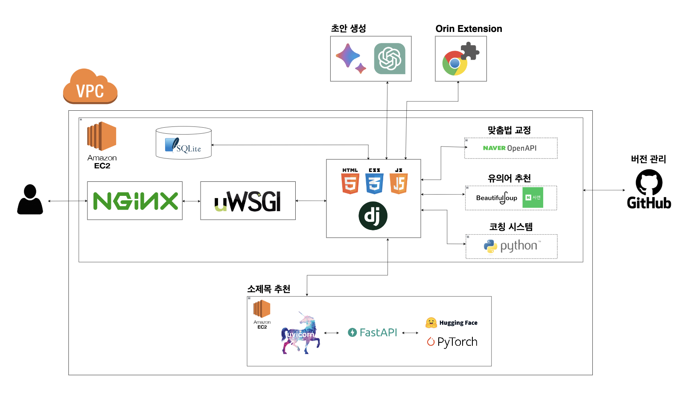

#  오린 : 자기소개서 올인원 서비스
- KT AIVLE School 3기 AI트랙 3조 빅프로젝트
- 프로젝트 기간 : 2023.05.29 ~ 2023.07.11
- <a href="https://drive.google.com/file/d/1t4_7KzQVug6OsgJlpAxVHiiK-Ao1_NUD/view?usp=drive_link" target="_blank" rel="noopener noreferrer">과제 정의서</a>
<br>

## 📋 목차
1. [서비스 소개](#-서비스-소개)
2. [주요 서비스 기능](#-주요-서비스-기능)
3. [아키텍처 플로우](#-아키텍처-플로우)
4. [파일 구조](#-파일-구조)
5. [팀원 및 역할](#-팀원-및-역할)
6. [기술 스택](#-기술-스택)
<br>

## 💡 서비스 소개
#### 1. 주제 선정 배경
- 많은 취업준비생들이 자기소개서 작성에 어려움을 겪고 있음.
- 채용 플랫폼에서 제공하는 자기소개서 서비스는 불편한 UI로 잘 사용하지 않음.
- 따라서, 자기소개서 <b>'작성 - 수정 - 관리'</b>를 한 번에 할 수 있는 All In One(올인원) 웹 서비스를 만들고자함.
#### 2. 기대효과
- 편의성 : 신입, 경력직 관계없이 한 곳에서 자기소개서 관리 가능
- 확장성 : 소제목 모델을 다양한 비즈니스에 적용 가능
- 경제성 : 자기소개서 컨설팅에 투자되는 시간과 비용 절약
- 크롬 익스텐션 서비스 : 크롬 브라우저에서 원하는 글을 실시간 교정하여 편의성 제공
<br>

## ❗ 주요 서비스 기능
#### 1. 자기소개서 초안 생성 서비스
#### 2. 자기소개서 수정 서비스
- 맞춤법 교정
- 소제목 추천
- 유의어 추천
- 자기소개서 ai 코칭
#### 3. 자기소개서 관리 서비스
- 자소서 보관함
- .docx 파일 저장
#### 4. chrome extension (크롬 확장 프로그램)
- 크롬 브라우저에서 서비스 이용 가능 (맞춤법 교정, 유의어 추천)
- 드래그 후, 우클릭하면 사이트로 바로 이동
<br>

## 🔀 아키텍처 플로우

<br>

## 📂 파일 구조
```
📁 AI_01_03_Orin
├── 📃 README.md
├── 📃 agreement.html        --- 개인정보동의서 
├── 📁 my_extension          --- Chrome Extension
├── 📁 mysite                --- Orin Web Service 
│   ├── 📁 board             --- Q & A 게시판
│   ├── 📁 common            --- 회원 관리 페이지
│   ├── 📁 correction        --- 자기소개서 수정, 관리
│   ├── 📁 draft             --- 자기소개서 초안
│   ├── 📁 mysite       
│   ├── 📁 static       
│   ├── 📁 templates    
│   └── 📃 manage.py 
├── requirements.txt         --- Window
└── requirements_mac.txt     --- Mac
```
<br>

## 🧑‍🤝‍🧑 팀원 및 역할
<table>
  <tbody>
    <tr>
      <td align="center">
        <a href="https://github.com/jjhh0210">
            <br>
          <sub><b>박지현</b></sub>
        </a>
      </td>
      <td align="center">
        <a href="https://github.com/ttoro-lee">
            <br>
          <sub><b>이운문</b></sub>
        </a>
      </td>
      <td align="center">
        <a href="https://github.com/jian1114">
            <br>
          <sub><b>이지안</b></sub>
        </a>
      </td>
      <td align="center">
        <a href="https://github.com/ayocado">
            <br>
          <sub><b>윤용완</b></sub>
        </a>
      </td>
      <td align="center">
        <a href="https://github.com/ksj1368">
            <br>
          <sub><b>장성준</b></sub>
        </a>
      </td>
      <td align="center">
        <a href="https://github.com/h4ndnf">
            <br>
          <sub><b>최한울</b></sub>
        </a>
      </td>
    </tr>
    <tr>
      <td align="center">BE & Infra</td>
      <td align="center">BE & Infra</td>
      <td align="center">AI & Infra</td>
      <td align="center">FE</td>
      <td align="center">BE</td>
      <td align="center">FE</td>
    </tr>
  </tbody>
</table>
<br>

## 💻 기술 스택
<table>
  <thead>
    <tr>
      <th align='center'>영역</th>
      <th align='center'>기술</th>
    </tr>
  </thead>
  <tbody>
    <tr>
      <td align='center'><strong>프론트엔드</strong></td>
      <td align='center'>
        
        
        
        
      </td>
    </tr>
    <tr>
      <td align='center'><strong>백엔드</strong></td>
      <td align='center'>
        
        
        
      </td>
    </tr>
    <tr>
      <td align='center'><strong>AI</strong></td>
      <td align='center'>
        
        
        
        
      </td>
    </tr>
    <tr>
      <td align='center'><strong>API</strong></td>
      <td align='center'>
        
        
        
      </td>
    </tr>
    <tr>
      <td align='center'><strong>인프라</strong></td>
      <td align='center'>
        
        
        
      </td>
    </tr>
    <tr>
      <td align='center'><strong>UI/UX</strong></td>
      <td align='center'>
        
      </td>
    </tr>
    <tr>
      <td align='center'><strong>협업</strong></td>
      <td align='center'>
        
        
        
        
      </td>
    </tr>
  </tbody>
</table>
